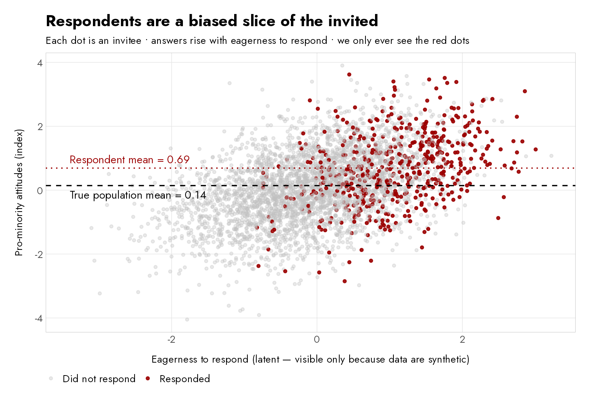
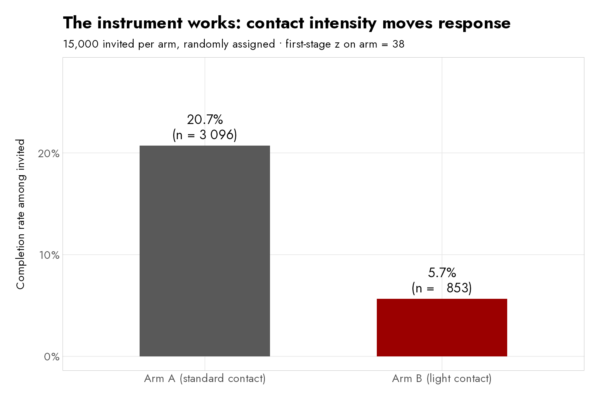
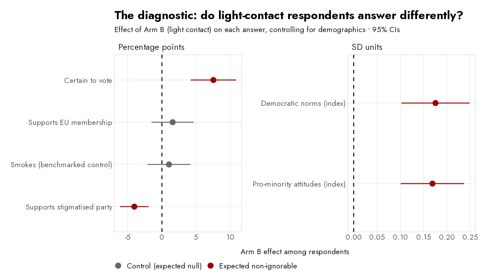
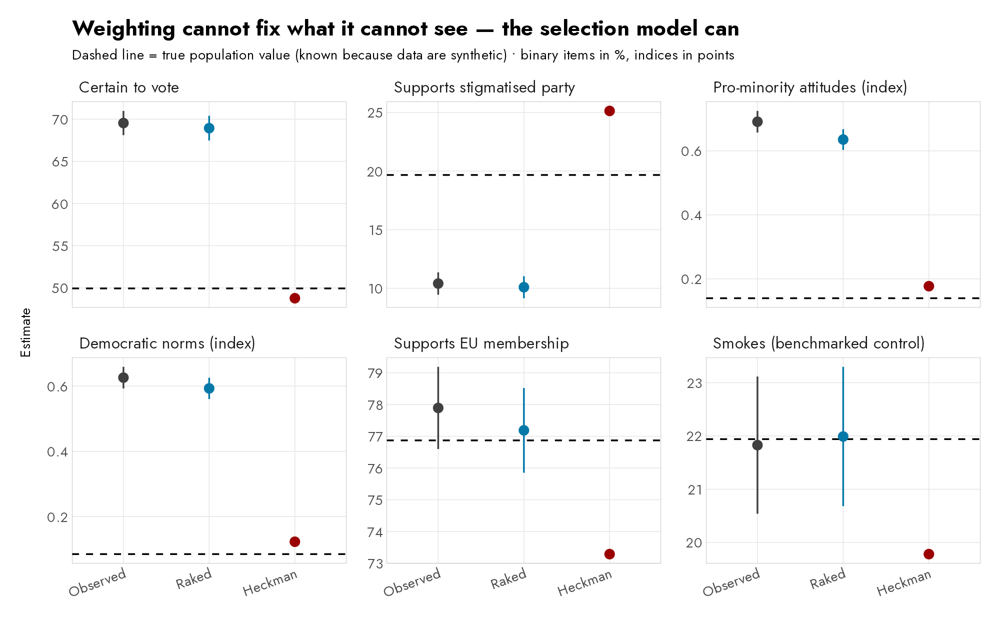
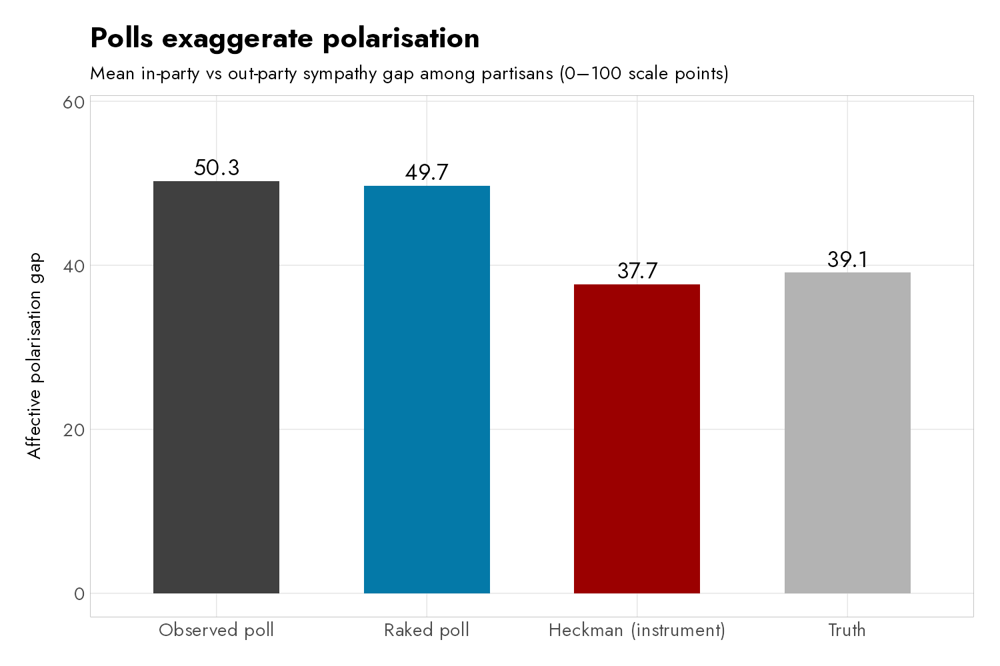

```{r}
#| label: setup
#| include: false
key <- readRDS("output/key_numbers.rds")
est <- key$est
g <- function(item, estimator) {
  v <- est$est_u[est$item == item & est$estimator == estimator]
  round(v[1], ifelse(item %in% c("minor", "norms"), 2, 1))
}
rho_v <- function(item) round(key$rho$rho[key$rho$item == item], 2)
rho_z <- function(item) round(key$rho$z[key$rho$item == item], 1)
dg_v <- function(item) round(key$diag$est_u[key$diag$item == item], 1)
```

## Surveys have a problem

- Response rates have collapsed: in a typical Polish online (CAWI) panel survey, **fewer than one invitee in ten** completes the questionnaire.
- Everything we report — turnout forecasts, party support, attitudes to democracy — comes from the small, self-selected group that *chose* to answer.
- The standard repair is **weighting**: adjust the sample until it matches the population on age, gender, education and place of residence.
- Weighting rests on one enormous assumption: **people who answer are just like the people who don't — once demographics match.**

## When the assumption fails: non-ignorable nonresponse

- For many questions the assumption is fine. For some it fails badly: **the answer itself is linked to the willingness to respond.**
  - The politically engaged love political surveys — and they vote more.
  - The distrustful avoid pollsters — and they hold distinctive views.
- This is **non-ignorable nonresponse** (Bailey 2024): the missing differ in their *opinions*, not just their demographics — a problem invisible to demographic weights.

## The synthetic world

- We simulate a country of 100,000 people, so the true answers are **known exactly**.
- Two hidden traits drive both *whether* people respond and *what* they think:
  - **political engagement** — ↑ response; ↑ turnout, pro-minority and pro-democratic answers;
  - **institutional trust** — ↑ response; ↓ support for a stigmatised anti-establishment party.
- Six survey items: four where the hidden traits matter (**flagged**), two that depend on demographics only (**controls**: EU support, smoking).
- We field a survey among 30,000 randomly invited people — with one trick built in.

## The design: randomise the contact protocol {.smaller}

```{mermaid}
%%| fig-width: 9
flowchart LR
    I["30,000 invitees<br>(random sample)"] --> R{{"random<br>50 / 50"}}
    R --> A["<b>Arm A — standard contact</b><br>invitation + reminders + bonus points"]
    R --> B["<b>Arm B — light contact</b><br>one bare invitation, then silence"]
    A --> RA["20.7% respond (n = 3,096)<br><i>eager <b>and</b> reluctant types</i>"]
    B --> RB["5.7% respond (n = 853)<br><i>only the most eager types</i>"]
    style A fill:#e8e8e8,stroke:#555
    style B fill:#fdeceb,stroke:#9B0000
```

- **Compare their answers, question by question**: same answers → nonresponse ignorable, weighting fine; different answers → bias detected.
- This randomly assigned nudge is a **randomised response instrument** (Bailey 2024, ch. 10): it moves *whether* people respond without touching *what they think*.

## Why the respondent mean goes wrong



# Results

## Step 1 — the instrument works



- A **15-point response-rate gap** from randomly assigned contact intensity: the *inclusion condition* holds.

## Step 2 — the arms disagree exactly where they should



::: {.smaller}
Light-contact respondents report **more** turnout (+`r dg_v("turnout")` pp), **less** stigmatised-party support (`r dg_v("partyS")` pp) and **more** progressive attitudes — while both controls sit at zero.
:::

## Step 3 — weighting does not rescue the flagged items {.smaller}

| Item | Truth | Observed poll | After raking | Still off by |
|---|---:|---:|---:|---:|
| Certain to vote | `r g("turnout","Truth")`% | `r g("turnout","Observed")`% | `r g("turnout","Raked (conventional)")`% | **+`r round(g("turnout","Raked (conventional)") - g("turnout","Truth"),1)` pp** |
| Stigmatised party | `r g("partyS","Truth")`% | `r g("partyS","Observed")`% | `r g("partyS","Raked (conventional)")`% | **−`r abs(round(g("partyS","Raked (conventional)") - g("partyS","Truth"),1))` pp** |
| Pro-minority index | `r g("minor","Truth")` | `r g("minor","Observed")` | `r g("minor","Raked (conventional)")` | **+`r round(g("minor","Raked (conventional)") - g("minor","Truth"),2)`** |
| EU support (control) | `r g("eu","Truth")`% | `r g("eu","Observed")`% | `r g("eu","Raked (conventional)")`% | ✓ fine |
| Smoking (control) | `r g("smoke","Truth")`% | `r g("smoke","Observed")`% | `r g("smoke","Raked (conventional)")`% | ✓ fine |

- Raking matches the sample to the population on every demographic — and moves the flagged estimates barely at all.

## Step 4 — selection models plus the instrument recover the truth



## Reading the results like Bailey's decision tree {.smaller}

| Item | ρ̂ (selection–outcome correlation) | Verdict | Correct tool |
|---|---:|---|---|
| Certain to vote | `r rho_v("turnout")` (z = `r rho_z("turnout")`) | non-ignorable | selection model |
| Stigmatised party | `r rho_v("partyS")` (z = `r rho_z("partyS")`) | non-ignorable | selection model |
| Pro-minority index | `r rho_v("minor")` (z = `r rho_z("minor")`) | non-ignorable | selection model |
| Democratic norms | `r rho_v("norms")` (z = `r rho_z("norms")`) | non-ignorable | selection model |
| EU support | `r rho_v("eu")` (z = `r rho_z("eu")`) | ignorable | **keep weighting** |
| Smoking | `r rho_v("smoke")` (z = `r rho_z("smoke")`) | ignorable | **keep weighting** |

- Where ρ̂ ≈ 0, weighting is *better* — selection models add noise you do not need.

## Polls exaggerate polarisation



::: {.smaller}
Engaged partisans respond more *and* feel more hostility towards the other side, so the observed gap (`r round(key$pol$gap[key$pol$estimator=="Observed poll"],1)`) overstates the true one (`r round(key$pol$gap[key$pol$estimator=="Truth"],1)`). Bailey found precisely this in the US: eager Democrats and eager Republicans are both more extreme than their quieter co-partisans.
:::

## The FRBN pilot

- **~2,000 completes** from a Polish CAWI panel, invitations randomised 50/50 into standard vs light contact; the agency tags every interview with its arm.
- Questionnaire mixes items expected to be affected by non-ignorable nonresponse bias (turnout, stigmatised parties, minorities, democratic norms) with **controls** — including items benchmarked against official statistics and election results.
- **Pre-registered** hypotheses, tests and decision rules; full code and anonymised data published.
- Output: the first map of *which* Polish survey questions carry non-ignorable nonresponse — and a **validated, reusable protocol** for PGSW and future studies.