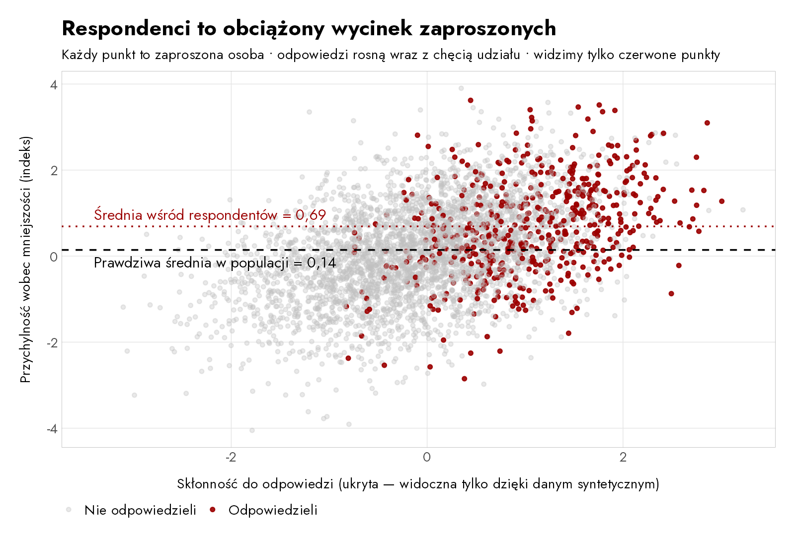
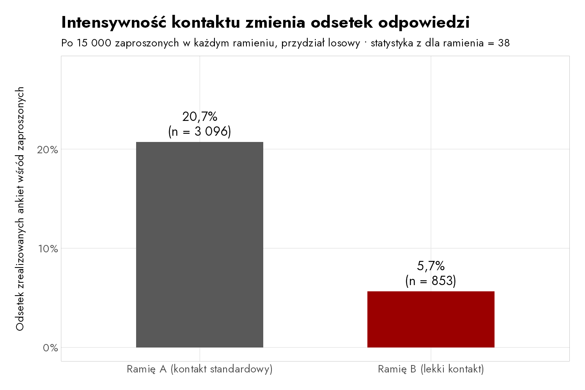
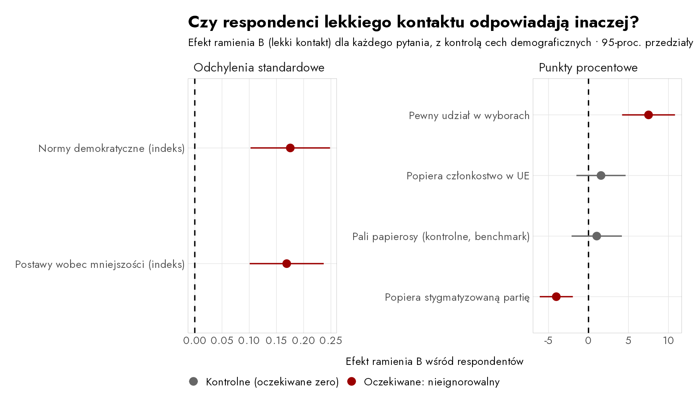
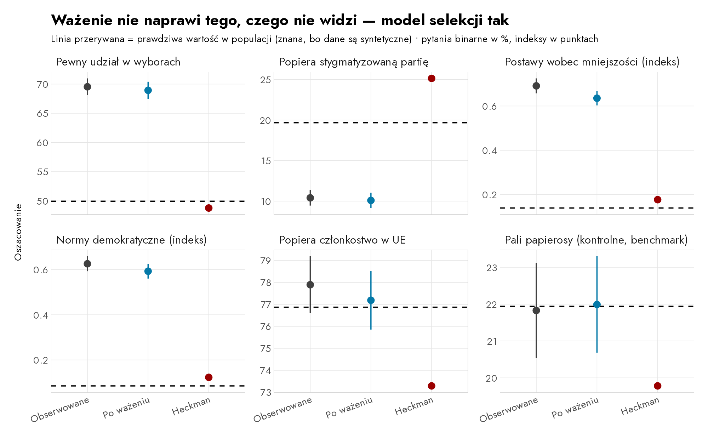
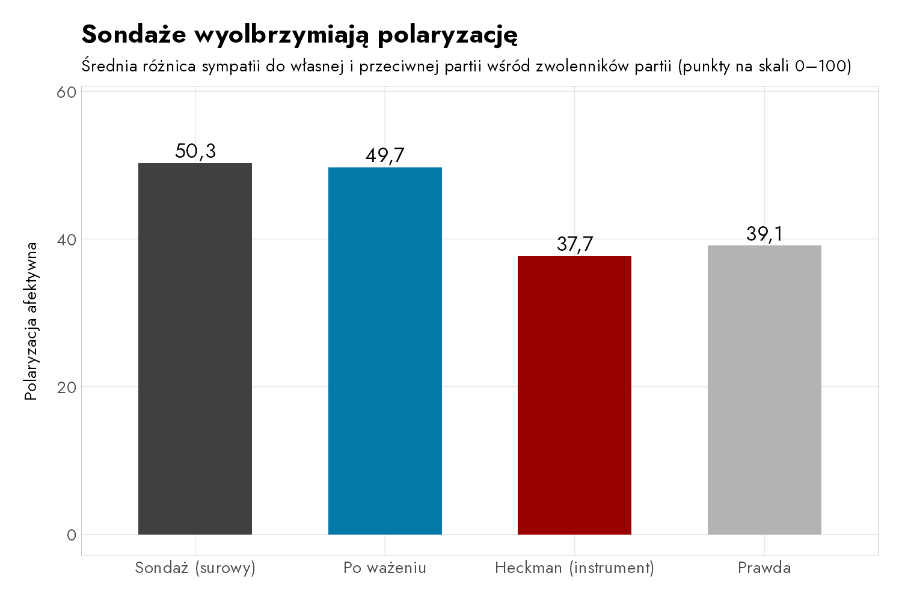

```{r}
#| label: setup
#| include: false
key <- readRDS("output/key_numbers.rds")
est <- key$est
g <- function(item, estimator) {
  v <- est$est_u[est$item == item & est$estimator == estimator]
  round(v[1], ifelse(item %in% c("minor", "norms"), 2, 1))
}
pn <- function(x, d = 1) {
  formatC(x, format = "f", digits = d, decimal.mark = ",")
}
rho_v <- function(item) pn(key$rho$rho[key$rho$item == item], 2)
rho_z <- function(item) pn(key$rho$z[key$rho$item == item], 1)
dg_v <- function(item, d = 1) pn(key$diag$est_u[key$diag$item == item], d)
```

## Sondaże mają problem

- Wskaźniki odpowiedzi się załamały: w typowym polskim sondażu internetowym (CAWI) ankietę wypełnia **mniej niż co dziesiąta zaproszona osoba**.
- Wszystko, o czym informujemy — prognozy frekwencji, poparcie partii, postawy wobec demokracji — pochodzi od małej, samoselekcjonującej się grupy, która *zechciała* odpowiedzieć.
- Standardową naprawą jest **ważenie**: dopasowujemy próbę do populacji pod względem wieku, płci, wykształcenia i miejsca zamieszkania.
- Ważenie opiera się na jednym potężnym założeniu: **osoby, które odpowiadają, są takie same jak te, które nie odpowiadają — o ile zgadzają się cechy demograficzne.**

## Gdy założenie zawodzi: nieignorowalny brak odpowiedzi

- Dla wielu pytań założenie jest w porządku. Dla niektórych zawodzi z hukiem: **sama treść odpowiedzi jest powiązana ze skłonnością do udziału w badaniu.**
  - Zaangażowani politycznie lubią sondaże polityczne — i częściej głosują.
  - Nieufni unikają ankieterów — i mają odrębne poglądy.
- To **nieignorowalny brak odpowiedzi** (Bailey 2024): brakujący różnią się *opiniami*, a nie tylko demografią — problem niewidoczny dla wag demograficznych.

## Świat syntetyczny

- Symulujemy kraj liczący 100 000 osób, więc prawdziwe odpowiedzi są **znane dokładnie**.
- Dwie ukryte cechy wpływają zarówno na to, *czy* ludzie odpowiadają, jak i na to, *co* myślą:
  - **zaangażowanie polityczne** — ↑ odpowiedzi; ↑ frekwencja, postawy przychylne mniejszościom i prodemokratyczne;
  - **zaufanie do instytucji** — ↑ odpowiedzi; ↓ poparcie dla stygmatyzowanej partii antyestablishmentowej.
- Sześć pytań: cztery, w których ukryte cechy mają znaczenie (**flagowane**), i dwa zależne wyłącznie od demografii (**kontrolne**: poparcie dla UE, palenie papierosów).
- Realizujemy badanie wśród 30 000 losowo zaproszonych osób — z jedną wbudowaną sztuczką.

## Projekt badania: losujemy protokół kontaktu {.smaller}

```{mermaid}
%%| fig-width: 9
flowchart LR
    I["30 000 zaproszonych<br>(próba losowa)"] --> R{{"losowy podział<br>50 / 50"}}
    R --> A["<b>Ramię A — kontakt standardowy</b><br>zaproszenie + przypomnienia + dodatkowe punkty"]
    R --> B["<b>Ramię B — lekki kontakt</b><br>jedno zaproszenie, potem cisza"]
    A --> RA["odpowiada 20,7% (n = 3 096)<br><i>typy chętne <b>i</b> niechętne</i>"]
    B --> RB["odpowiada 5,7% (n = 853)<br><i>tylko najbardziej chętni</i>"]
    style A fill:#e8e8e8,stroke:#555
    style B fill:#fdeceb,stroke:#9B0000
```

- **Porównujemy odpowiedzi, pytanie po pytaniu**: takie same → brak odpowiedzi ignorowalny, ważenie wystarcza; różne → obciążenie wykryte.
- Ten losowo przydzielony bodziec to **losowy instrument odpowiedzi** (Bailey 2024, rozdz. 10): zmienia to, *czy* ludzie odpowiadają, nie zmieniając tego, *co myślą*.

## Dlaczego średnia z respondentów jest obciążona



## Instrument działa



- **Różnica 15 punktów procentowych** w odsetku odpowiedzi, wywołana losowo przydzieloną intensywnością kontaktu: warunek *włączenia* jest spełniony.

## Ramiona różnią się dokładnie tam, gdzie powinny



::: {.smaller}
Respondenci lekkiego kontaktu deklarują **wyższą** frekwencję (+`r dg_v("turnout")` pp), **niższe** poparcie dla stygmatyzowanej partii (`r dg_v("partyS")` pp) i **bardziej** progresywne postawy — a oba pytania kontrolne siedzą na zerze.
:::

## Ważenie nie ratuje flagowanych pytań {.smaller}

| Pytanie | Prawda | Sondaż (surowy) | Po ważeniu | Nadal błąd |
|---|---:|---:|---:|---:|
| Pewny udział w wyborach | `r pn(g("turnout","Truth"))`% | `r pn(g("turnout","Observed"))`% | `r pn(g("turnout","Raked (conventional)"))`% | **+`r pn(round(g("turnout","Raked (conventional)") - g("turnout","Truth"),1))` pp** |
| Stygmatyzowana partia | `r pn(g("partyS","Truth"))`% | `r pn(g("partyS","Observed"))`% | `r pn(g("partyS","Raked (conventional)"))`% | **−`r pn(abs(round(g("partyS","Raked (conventional)") - g("partyS","Truth"),1)))` pp** |
| Postawy wobec mniejszości | `r pn(g("minor","Truth"),2)` | `r pn(g("minor","Observed"),2)` | `r pn(g("minor","Raked (conventional)"),2)` | **+`r pn(round(g("minor","Raked (conventional)") - g("minor","Truth"),2),2)`** |
| Poparcie dla UE (kontrolne) | `r pn(g("eu","Truth"))`% | `r pn(g("eu","Observed"))`% | `r pn(g("eu","Raked (conventional)"))`% | ✓ w porządku |
| Palenie (kontrolne) | `r pn(g("smoke","Truth"))`% | `r pn(g("smoke","Observed"))`% | `r pn(g("smoke","Raked (conventional)"))`% | ✓ w porządku |

- Ważenie dopasowuje próbę do populacji pod względem wszystkich cech demograficznych — a flagowane oszacowania ledwie drgnęły.

## Model selekcji z instrumentem odzyskuje prawdę



## Odczytanie wyników według drzewa decyzyjnego Baileya {.smaller}

| Pytanie | ρ̂ (korelacja selekcja–odpowiedź) | Werdykt | Właściwe narzędzie |
|---|---:|---|---|
| Pewny udział w wyborach | `r rho_v("turnout")` (z = `r rho_z("turnout")`) | nieignorowalny | model selekcji |
| Stygmatyzowana partia | `r rho_v("partyS")` (z = `r rho_z("partyS")`) | nieignorowalny | model selekcji |
| Postawy wobec mniejszości | `r rho_v("minor")` (z = `r rho_z("minor")`) | nieignorowalny | model selekcji |
| Normy demokratyczne | `r rho_v("norms")` (z = `r rho_z("norms")`) | nieignorowalny | model selekcji |
| Poparcie dla UE | `r rho_v("eu")` (z = `r rho_z("eu")`) | ignorowalny | **dalej ważyć** |
| Palenie | `r rho_v("smoke")` (z = `r rho_z("smoke")`) | ignorowalny | **dalej ważyć** |

- Tam, gdzie ρ̂ ≈ 0, ważenie jest *lepsze* — model selekcji dodaje szum, którego nie potrzebujemy.

## Sondaże wyolbrzymiają polaryzację



::: {.smaller}
Zaangażowani zwolennicy partii częściej odpowiadają *i* żywią większą niechęć do drugiej strony, więc obserwowana różnica (`r pn(key$pol$gap[key$pol$estimator=="Observed poll"])`) zawyża prawdziwą (`r pn(key$pol$gap[key$pol$estimator=="Truth"])`). Bailey znalazł dokładnie to samo w USA: chętni Demokraci i chętni Republikanie są bardziej skrajni niż ich milczący współpartyjnicy.
:::

## Pilotaż FRBN

- **Ok. 2000 zrealizowanych ankiet** z polskiego panelu CAWI; zaproszenia losowo dzielone 50/50 na kontakt standardowy i lekki; agencja oznacza każdy wywiad wskaźnikiem ramienia.
- Kwestionariusz łączy pytania, w których spodziewamy się obciążenia nieignorowalnym brakiem odpowiedzi (frekwencja, partie stygmatyzowane, mniejszości, normy demokratyczne), z pytaniami **kontrolnymi** — w tym z benchmarkiem w statystyce publicznej i wynikach wyborów.
- **Prerejestracja** hipotez, testów i reguł decyzyjnych; pełny kod i zanonimizowane dane zostaną opublikowane.
- Rezultat: pierwsza mapa tego, *które* pytania polskich sondaży obciąża nieignorowalny brak odpowiedzi — oraz **zwalidowany protokół wielokrotnego użytku** dla PGSW i kolejnych badań.
